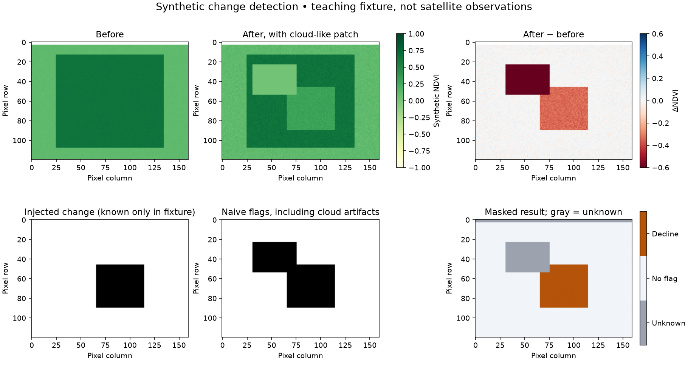

# New geospatial learning experiences: a teaching showcase

This personal GitHub series demonstrates engaging, assessable geospatial and AI learning experiences that could complement an existing curriculum. Each lesson pairs a working example with an independent exercise and observable evidence of student learning.

The invitation is simple: **here are ideas we could introduce—and here is a working example of how to teach them.** These materials are a prototype for discussion and classroom pilots, not evidence of measured improvements in student outcomes.

## Start with a ten-minute demonstration

Open [lesson 6.1: What changed—and what only looks like change?](../06-change-detection/01_satellite_change_detection.ipynb).

1. Ask the audience to predict whether every apparent vegetation decline indicates an actual landscape change.
2. Show the before/after images, naive flags and masked result below. Gray means unknown, not unchanged.
3. Run the one-pixel displacement example: an unchanged scene produces apparent change.
4. Show the independent challenge and rubric. Learners must make a decision, test it and justify their interpretation.

**What this demonstrates:** a visible result, a scientific judgment, and an assessable student artifact in one lesson. All imagery above is generated teaching data. It is not a satellite observation or environmental finding. The notebook regenerates this figure and a threshold-sensitivity table.

## Choose an experience by its learning outcome

Times below are suggested teaching allocations, not measured completion times. Each row's artifact is paired with the lesson's independent exercise and explanation. Python variables, arrays and DataFrames are assumed; specific prerequisites are listed below.

| Lesson | Engaging question | Evidence to assess | Suggested time | Additional preparation |
|---|---|---|---|---|
| [1.1 Reprojection](../01-foundations-pyproj-rtree/01_pyproj_reprojection.ipynb) | How can two coordinates describe one place? | Round-trip check and independently explained overlay | 45–60 min | Coordinate concepts |
| [1.2 Spatial indexing](../01-foundations-pyproj-rtree/02_rtree_spatial_index.ipynb) | Why can an index return a false match? | Hole counterexample and exact-predicate reasoning | 45–60 min | Points and polygons |
| [2.1 Raster learning](../02-pytorch-torchgeo/01_torchgeo_intro.ipynb) | What connects a map pixel to a model input? | Raster/tensor checks and diagnosed channel or location error | 60–90 min | Lesson 1.1; array dimensions |
| [3.1 Earth embeddings](../03-earth-embeddings/01_alphaearth_classifier.ipynb) | Does a model generalize beyond its training geography? | Spatial holdout, baseline and interpretation | 60–90 min | Classification concepts |
| [3.2 Representation comparison](../03-earth-embeddings/02_geotessera_comparison.ipynb) | What makes a model comparison fair? | Shared cohort and documented exclusions | 60–90 min | Lesson 3.1 |
| [4.1 H3 aggregation](../04-indexing-visualization/01_h3_binning.ipynb) | Does changing map scale change the story? | Two resolutions, conserved counts and weighted means | 45–60 min | Grouped summaries |
| [4.2 Interactive maps](../04-indexing-visualization/02_pydeck_hexlayer.ipynb) | What claim does this map encourage? | Map, informative tooltips and a critique | 45–60 min | Lesson 4.1 |
| [4.3 Large-data visualization](../04-indexing-visualization/03_datashader_fullres.ipynb) | What does a pixel hide? | Aggregation/timing comparison and a scale explanation | 45–60 min | Array aggregation |
| [5.1 Image retrieval](../05-semantic-search/01_remoteclip_retrieval.ipynb) | Can the best match still be irrelevant? | Ranked candidates and independent relevance judgments | 45–90 min | Vectors and similarity |
| [5.2 Geospatial RAG](../05-semantic-search/02_geospatial_rag.ipynb) | Can the evidence support the answer? | Retrieval metrics, source trace and unsupported-question analysis | 60–90 min | Lesson 5.1; text/DataFrames |
| [6.1 Change detection](../06-change-detection/01_satellite_change_detection.ipynb) | What changed—and what only looks like change? | Independent experiment, masked map, metric table and interpretation | 75–90 min | Lesson 1.1; lesson 2.1 helpful |
| [7.1 Decision trees](../07-decision-trees/01_geospatial_decision_tree.ipynb) | Can you explain a map prediction? | Traced path, independent experiment and held-out evaluation | 75–90 min | Basic arrays/DataFrames; can precede embeddings |
| [8.1 Simple ANN](../08-neural-networks/01_simple_ann.ipynb) | How does a small network learn? | Forward-pass explanation, learning curves and controlled experiment | 75–90 min | Arrays and multiplication; calculus optional |
| [8.2 Simple CNN](../08-neural-networks/02_simple_cnn.ipynb) | What does pixel arrangement reveal? | Hand convolution, feature maps and controlled validation experiment | 90 min | Arrays and lesson 8.1 concepts |
| [8.3 Simple LSTM](../08-neural-networks/03_simple_lstm.ipynb) | Does remembering history help? | Gate update, split audit and baseline comparison | 90–120 min | Lesson 8.1; PyTorch installed |
| [8.4 Simple attention](../08-neural-networks/04_simple_attention.ipynb) | Which observations does attention combine? | Hand calculation, heatmap and positional ablation | 90–120 min | Lessons 8.1/8.3; PyTorch |
| [9.1 Active learning](../09-active-learning/01_active_learning.ipynb) | Where should we spend 50 labels? | Equal-budget curves, coverage map and recommendation | 90–120 min | Basic classification; lesson 7.1 helpful |

## What is runnable, and what requires preparation?

- **Default practice:** all seventeen lessons have a synthetic/offline path after environment installation; lessons 8.3–8.4 additionally require PyTorch (`requirements-lstm.txt`). These paths teach mechanics and evaluation; they do not establish performance on real environmental data.
- **Optional model/data labs:** TorchGeo, Earth embeddings and RemoteCLIP require the preparation described in the [real-data guide](REAL_DATA.md). RAG generation requires a separately installed local Ollama model; its default path retrieves evidence and constructs prompts without generating model answers.
- **Change-detection extension:** the default lesson runs completely. Actual satellite analysis is a guided extension requiring learner-supplied imagery and independent labels; it is not a bundled real-scene demonstration.
- **Validation:** see [lesson 6.1 validation](CHANGE_DETECTION_VALIDATION.md). Classroom learning gains have not yet been evaluated.

## Assess decisions, not just successful execution

Every demonstration should lead to an independent alteration and a justified conclusion. A shared review checklist can ask:

1. Can another learner reproduce the result from a fresh run?
2. Did the learner change a meaningful input, method or evaluation choice?
3. Do the measurements support the interpretation?
4. Are missing data, scope and limitations explicit?

Lesson 6.1 makes this concrete with a 10-point rubric: geometry/coverage (2), independent experiment (3), evaluation reasoning (3), and communication/reproduction (2). A polished map alone is insufficient.

## A manageable classroom pilot

Offer one 90-minute change-detection session using the existing course environment. Collect a short prediction before the demonstration, the independent challenge, and an exit explanation distinguishing unknown from unchanged. Record setup failures, completion time and common misconceptions. Review anonymized artifacts against the rubric; use those observations to decide whether to expand the pilot. Do not claim learning gains merely because the notebook runs.

## Ideas for later development

These are proposals, not completed lessons:

| Proposed extension | Student decision | Assessable artifact |
|---|---|---|
| Transfer across places | Where does a trained model stop working? | Held-out regional performance and failure analysis |
| Multimodal investigation | What do imagery, measurements and reports jointly support? | Mapped evidence brief with claim-by-claim provenance |

A standalone watershed research assistant could grow from lesson 5.2; see the [capstone extension](CAPSTONE.md#optional-standalone-extension-watershed-research-assistant). A separate repository would give ingestion, persistent indexing and a user interface room to develop while this series stays focused on teachable examples.
